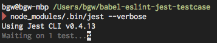
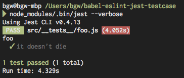

# babel-eslint-jest-testcase

babel-eslint breaks if called from within jest, because `module.parent` is
`undefined`. See 
[facebook/jest#411](https://github.com/facebook/jest/issues/411).

The goal here is to propose a minor modification to babel-eslint that fixes
things in jest, though the proper long-term solution is to generate the `parent`
property in jest.

## Reproducing

```
$ nvm use 0.10   # jest doesn't support 0.12, because of jsdom limitations
$ npm install
$ node_modules/.bin/jest --verbose
```



Jest exits prematurely, with no error message (an exception is thrown, it's just 
swallowed because of how jest modifies/breaks `console.error`).

## Patching

Rewrite

```js
var eslintLoc;
try {
  eslintLoc = Module._resolveFilename("eslint", module.parent);
} catch (err) {
  throw new ReferenceError("couldn't resolve eslint");
}
```

as

```js
var eslintLoc;
try {
  eslintLoc = Module._resolveFilename("eslint", module.parent);
} catch (err) {
  try {
    eslintLoc = require.resolve("eslint");
  } catch(err) {
    throw new ReferenceError("couldn't resolve eslint");
  }
}
```

and re-run

```js
$ node_modules/.bin/jest --verbose
```


